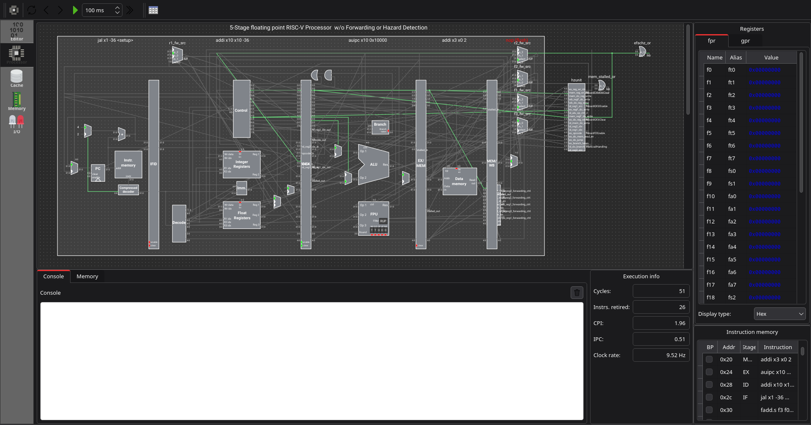

# Ripes — IST Fork (RISC-V F-Extension)




This is a fork of [Ripes](https://github.com/mortbopet/Ripes), a visual computer architecture simulator and assembly code editor for the [RISC-V instruction set architecture](https://content.riscv.org/wp-content/uploads/2017/05/riscv-spec-v2.2.pdf).

For general Ripes usage, installation, and build instructions, see the [upstream README](https://github.com/mortbopet/Ripes/blob/master/README.md) and [documentation](https://github.com/mortbopet/Ripes/blob/master/docs/README.md) — this file only covers what's specific to this fork.

**Repository:** https://github.com/hpc-ulisboa/Ripes/tree/f_extension

**Course adoption:** starting 2026/2027, this fork will be used in the **Computer Architecture** course at [Instituto Superior Técnico (IST)](https://tecnico.ulisboa.pt/).

## What this fork adds

This fork implements the **RISC-V F-extension** (single-precision floating-point) & **D-Extension** (double-precision floating-point) as part of a master's thesis, integrated into Ripes's existing pipeline and memory model. For the full instruction reference (including fused multiply-add, conversion, compare, and pseudo instructions), see docs/f-extension.md.

| Feature                                | Description                                                                                                       | Status      |
| -------------------------------------- | ----------------------------------------------------------------------------------------------------------------- | ----------- |
| F-Extension for Single Cycle Processor | Adds F-extension floating-point instruction support to Ripes's single-cycle RISC-V processor model                | Implemented |
| FCSR Extension                         | Adds the floating-point control and status register (`fcsr`), including rounding mode and exception flag support  | Implemented |
| F-Extension for Pipelined Processors   | Adds F-extension support to Ripes's pipelined processor models, including handling of floating-point data hazards | Implemented |
| F-Extension for Multi-cycle Processors | Adds F-extension support to Ripes's multi-cycle processor model                                                   | In testing  |
| D-Extension                            | Adds double-precision floating-point instruction support                                                          | In Progress |

## Building

This fork builds the same way as upstream Ripes — a standard CMake project, with no extra flags needed to enable floating-point support:

```
git clone --recursive -b f_extension https://github.com/hpc-ulisboa/Ripes.git
cd Ripes/
cmake .
Unix:               Windows:
make                jom.exe / nmake.exe / ...
```

See the [upstream README](https://github.com/mortbopet/Ripes/blob/master/README.md#building) for dependency details (Qt, CMake, etc.).

## Acknowledgements


This fork was implement by António Vidais with guidance from Prof. Nuno Roma & Prof. Pedro Tomás. It builds directly on the work of Morten Petersen and the Ripes contributors. Additional thanks to **NLS-04**, whose pull request contributed to this floating-point work.

If you build on the floating-point work in this fork, please also cite the thesis:

```
@mastersthesis{vidais2026fext,
  author = {António Cardoso Vidais},
  title  = {Improving RISC-V Coverage in Ripes Simulator : A Floating-Point Extension},
  school = {Instituto Superior Técnico, Universidade de Lisboa},
  year   = {2026},
  type   = {Master's thesis}
}
```

If you use the base simulator in papers or reports, please cite the original project:

```
@MISC{Ripes,
	author = {Morten Borup Petersen},
	title = {Ripes},
	howpublished = "\url{https://github.com/mortbopet/Ripes}"
}

@inproceedings{petersen2021ripes,
  title={Ripes: A Visual Computer Architecture Simulator},
  author={Petersen, Morten B},
  booktitle={2021 ACM/IEEE Workshop on Computer Architecture Education (WCAE)},
  pages={1--8},
  year={2021},
  organization={IEEE}
}
```
